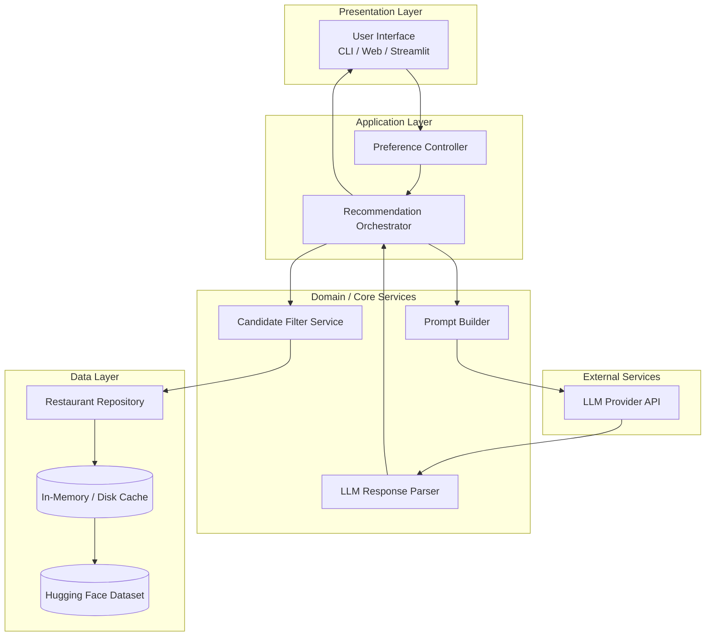
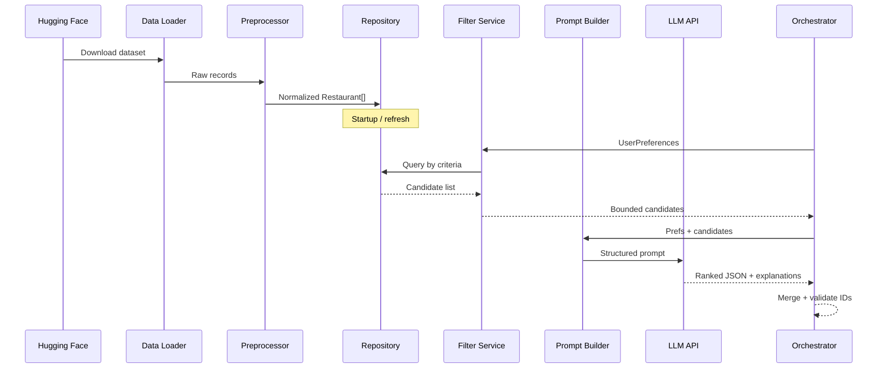
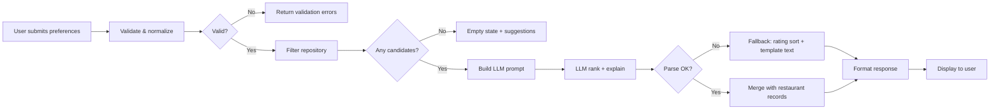
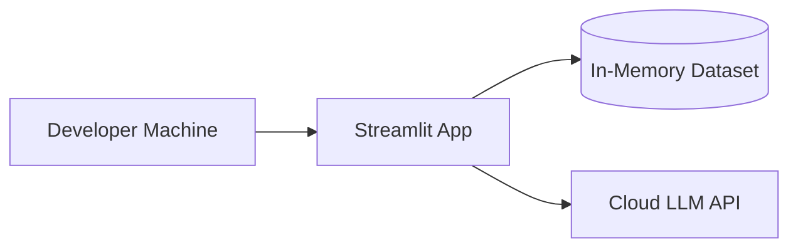
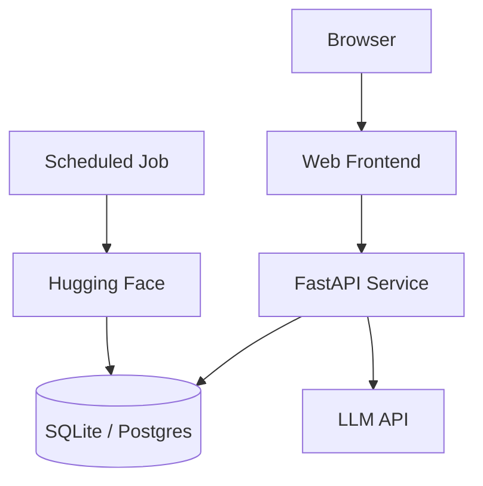

# Architecture: AI-Powered Restaurant Recommendation System

> Derived from [`context.md`](context.md) and the Zomato use-case problem statement.  
> This document describes **what** to build, **how** components interact, and **why** key design choices are made.

---

## Table of Contents

1. [Executive Summary](#1-executive-summary)
2. [Design Principles](#2-design-principles)
3. [High-Level Architecture](#3-high-level-architecture)
4. [Component Architecture](#4-component-architecture)
5. [Data Architecture](#5-data-architecture)
6. [Request Lifecycle](#6-request-lifecycle)
7. [Integration Layer & LLM Design](#7-integration-layer--llm-design)
8. [Application Layers](#8-application-layers)
9. [Interface & Output Contract](#9-interface--output-contract)
10. [Cross-Cutting Concerns](#10-cross-cutting-concerns)
11. [Technology Options](#11-technology-options)
12. [Deployment Topology](#12-deployment-topology)
13. [Future Extensions](#13-future-extensions)

---

## 1. Executive Summary

The system is a **preference-driven restaurant recommender** that:

1. Ingests and normalizes a real Zomato-style dataset from Hugging Face.
2. Accepts structured user preferences (location, budget, cuisine, rating, extras).
3. **Deterministically filters** the dataset to a bounded candidate set.
4. Uses an **LLM only on that candidate set** to rank, explain, and optionally summarize.
5. Renders human-readable results with grounded restaurant facts plus AI narratives.

The architecture deliberately separates **factual retrieval** (dataset + filters) from **subjective reasoning** (LLM), so recommendations stay traceable to real records and hallucination risk is reduced.

---

## 2. Design Principles

| Principle | Implication |
|-----------|-------------|
| **Grounded recommendations** | Every suggested restaurant must exist in the filtered candidate list passed to the LLM. |
| **Filter first, reason second** | Hard constraints (location, min rating, budget band) are applied before the LLM sees data. |
| **Bounded LLM context** | Send only top-N candidates (e.g., 15–30) to control cost, latency, and token limits. |
| **Structured in, structured out** | User input and LLM output should use schemas (JSON) where possible for validation. |
| **Explainability by default** | Each result includes an AI-generated “why this fits” tied to stated preferences. |
| **Progressive complexity** | MVP can be CLI or Streamlit; same core modules support a future web API. |

---

## 3. High-Level Architecture

### 3.1 Logical View



### 3.2 Layered Responsibility Model

| Layer | Components | Responsibility |
|-------|------------|----------------|
| **Presentation** | UI, forms, result cards | Collect preferences; display ranked recommendations |
| **Application** | Orchestrator, controllers | Coordinate filter → prompt → LLM → parse → format |
| **Domain** | Filter rules, budget mapping, ranking policy | Business logic independent of UI and LLM vendor |
| **Data** | Loader, preprocessor, repository | Ingest HF dataset; serve queryable restaurant records |
| **Integration** | Prompt templates, LLM client | Vendor-specific API calls; retries and timeouts |
| **External** | Hugging Face, LLM API | Source data and generative reasoning |

---

## 4. Component Architecture

### 4.1 Component Map

```
┌─────────────────────────────────────────────────────────────────┐
│                     Presentation Layer                          │
│  ┌──────────────┐  ┌──────────────┐  ┌──────────────────────┐  │
│  │ Preference   │  │ Results      │  │ Error / Empty State  │  │
│  │ Form         │  │ Renderer     │  │ Handler              │  │
│  └──────────────┘  └──────────────┘  └──────────────────────┘  │
└────────────────────────────┬────────────────────────────────────┘
                             │
┌────────────────────────────▼────────────────────────────────────┐
│                   Recommendation Orchestrator                   │
│   validate prefs → filter → build prompt → call LLM → merge     │
└─────┬──────────────────┬──────────────────┬─────────────────────┘
      │                  │                  │
┌─────▼─────┐    ┌───────▼───────┐   ┌──────▼──────┐
│ Preference│    │ Candidate     │   │ LLM         │
│ Validator │    │ Filter        │   │ Integration │
└───────────┘    └───────┬───────┘   └──────┬──────┘
                         │                  │
                  ┌──────▼───────┐   ┌──────▼──────┐
                  │ Restaurant   │   │ Prompt      │
                  │ Repository   │   │ Builder +   │
                  │              │   │ Parser      │
                  └──────┬───────┘   └─────────────┘
                         │
                  ┌──────▼───────┐
                  │ Data Loader  │
                  │ + Preprocess │
                  └──────┬───────┘
                         │
                  ┌──────▼───────┐
                  │ Hugging Face │
                  │ Dataset      │
                  └──────────────┘
```

### 4.2 Component Specifications

#### 4.2.1 Data Loader & Preprocessor

**Purpose:** One-time (or scheduled) ingestion from Hugging Face into an application-ready store.

| Concern | Design |
|---------|--------|
| **Source** | `ManikaSaini/zomato-restaurant-recommendation` on Hugging Face |
| **Load strategy** | Download via `datasets` library; persist as Parquet/CSV/SQLite for fast reload |
| **Normalization** | Trim strings; standardize city names; parse ratings as float; map cost to numeric + budget tier |
| **Schema mapping** | Map raw columns → canonical `Restaurant` model (see §5) |
| **Validation** | Drop or flag rows missing name, location, or rating; log counts |

**Outputs:** Clean `Restaurant[]` collection indexed for filtering (by city, cuisine, rating, cost).

---

#### 4.2.2 Restaurant Repository

**Purpose:** Abstract read access to restaurant data for the filter service.

| Operation | Description |
|-----------|-------------|
| `get_all()` | Return full normalized set (dev/small deployments) |
| `filter(criteria)` | Apply structured query (location, cuisine, rating, budget) |
| `get_by_ids(ids)` | Hydrate full records after LLM returns ranked IDs |

**Implementation options:**

- **In-memory (MVP):** Pandas DataFrame or list of dataclasses loaded at startup.
- **Persistent (scale):** SQLite with indexes on `location`, `cuisine`, `rating`, `cost_for_two`.

---

#### 4.2.3 Preference Validator

**Purpose:** Validate and normalize user input before filtering.

| Field | Validation | Normalization |
|-------|------------|---------------|
| `location` | Required; non-empty string | Title-case; alias map (e.g., "Bengaluru" → "Bangalore") |
| `budget` | Enum: `low` \| `medium` \| `high` | Map to cost ranges (config-driven) |
| `cuisine` | Optional; string or list | Lowercase; partial match token |
| `min_rating` | Optional; 0.0–5.0 | Default e.g. 3.5 if omitted |
| `additional_preferences` | Optional free text | Passed through to LLM only (soft signal) |

---

#### 4.2.4 Candidate Filter Service

**Purpose:** Apply **hard filters** deterministically; produce a bounded candidate list.

**Filter pipeline (ordered):**

1. **Location** — exact or fuzzy match on city/area field.
2. **Minimum rating** — `rating >= min_rating`.
3. **Cuisine** — contains match on cuisine string (supports multi-cuisine labels).
4. **Budget** — map `low|medium|high` to `cost_for_two` or `price_range` bands.
5. **Cap** — if results > `MAX_CANDIDATES` (e.g., 25), sort by rating desc and truncate.

**Empty result handling:** Return structured empty state with suggestions (relax rating, broaden location, change budget).

---

#### 4.2.5 Prompt Builder

**Purpose:** Construct a system + user prompt that constrains the LLM to reason only over provided JSON candidates.

**Prompt structure:**

- **System:** Role (restaurant advisor), rules (only recommend from list, output JSON schema, cite preference alignment).
- **User:** Serialized `UserPreferences` + `CandidateRestaurant[]` (id, name, cuisine, rating, cost, location snippet).
- **Constraints:** Max recommendations (e.g., top 5), require `restaurant_id`, `rank`, `explanation`; optional `summary`.

---

#### 4.2.6 LLM Integration Client

**Purpose:** Call the LLM provider with retries, timeouts, and response extraction.

| Concern | Approach |
|---------|----------|
| **Model** | Groq family model with low temperature for consistent ranking; choose a cost-effective Groq model for demos |
| **Temperature** | Low (0.2–0.4) for consistent ranking |
| **Output** | Request JSON mode / structured output when supported |
| **Fallback** | If LLM fails: return filter-sorted top-N with template explanations |

---

#### 4.2.7 LLM Response Parser & Merger

**Purpose:** Parse LLM JSON; validate IDs exist in candidates; merge with full restaurant records.

**Validation rules:**

- Reject unknown `restaurant_id` values.
- Deduplicate ranks.
- If fewer than requested, backfill from filter order with note “ranked by rating (LLM unavailable).”

---

#### 4.2.8 Recommendation Orchestrator

**Purpose:** Single entry point for the “recommend” use case.

```python
# Pseudocode contract
def recommend(preferences: UserPreferences) -> RecommendationResponse:
    prefs = validate(preferences)
    candidates = filter_service.apply(prefs)
    if not candidates:
        return empty_response(suggestions=...)
    prompt = prompt_builder.build(prefs, candidates)
    llm_raw = llm_client.complete(prompt)
    ranked = parser.parse_and_validate(llm_raw, candidates)
    return formatter.to_display(ranked, summary=...)
```

---

#### 4.2.9 Results Formatter / Presentation

**Purpose:** Map domain objects to UI-ready cards.

Each **RecommendationCard** includes:

- Restaurant name  
- Cuisine  
- Rating  
- Estimated cost  
- AI-generated explanation  
- Optional: overall summary paragraph  

---

## 5. Data Architecture

### 5.1 Canonical Domain Models

#### Restaurant (normalized)

```json
{
  "id": "string",
  "name": "string",
  "location": "string",
  "city": "string",
  "cuisine": "string",
  "rating": 4.2,
  "cost_for_two": 800,
  "budget_tier": "medium",
  "raw": {}
}
```

#### UserPreferences

```json
{
  "location": "Bangalore",
  "budget": "medium",
  "cuisine": "Italian",
  "min_rating": 4.0,
  "additional_preferences": "family-friendly, quick service"
}
```

#### Recommendation (output item)

```json
{
  "rank": 1,
  "restaurant_id": "abc123",
  "name": "Trattoria Example",
  "cuisine": "Italian, Pizza",
  "rating": 4.5,
  "estimated_cost": 1200,
  "explanation": "Matches your Italian preference and medium budget..."
}
```

#### RecommendationResponse

```json
{
  "recommendations": [],
  "summary": "Optional overview of the shortlist.",
  "metadata": {
    "candidates_considered": 18,
    "filters_applied": ["location", "rating", "cuisine", "budget"]
  }
}
```

### 5.2 Budget Tier Mapping (configurable)

| Tier | Typical `cost_for_two` range (INR) | Notes |
|------|-------------------------------------|-------|
| `low` | 0 – 500 | Adjust after inspecting dataset distribution |
| `medium` | 501 – 1500 | Percentile-based thresholds preferred |
| `high` | 1500+ | |

*Calibrate tiers using dataset histograms during preprocessing.*

### 5.3 Data Flow Diagram



---

## 6. Request Lifecycle

End-to-end flow for a single recommendation request:



### 6.1 Latency Budget (target)

| Stage | Target |
|-------|--------|
| Filter (in-memory) | < 100 ms |
| LLM call | 2–8 s (depends on model) |
| Parse + format | < 50 ms |
| **Total perceived** | < 10 s with loading indicator |

---

## 7. Integration Layer & LLM Design

### 7.1 Why a Dedicated Integration Layer

The integration layer sits between **filtered structured data** and the **LLM**, ensuring:

- Prompts are versioned and testable.
- Candidate sets are serialized consistently.
- The LLM cannot invent restaurants outside the provided list (enforced in prompt + post-validation).

### 7.2 Prompt Design Guidelines

**System instructions (summary):**

1. You are a restaurant recommendation assistant for Indian cities (Zomato-style).
2. Recommend **only** from the `candidates` array.
3. Rank by fit to `user_preferences`; use `additional_preferences` as soft signals.
4. Return **valid JSON** matching the output schema.
5. Each `explanation` must reference specific preference fields.

**Anti-hallucination measures:**

- Include explicit candidate `id` in the prompt.
- Post-parse: drop any recommendation whose `id` ∉ candidate set.
- Prefer JSON schema / function calling when the provider supports it.

### 7.3 Example Prompt Skeleton

```
SYSTEM:
You recommend restaurants only from the provided candidate list.
Output JSON: { "recommendations": [...], "summary": "..." }

USER:
Preferences:
{ "location": "Delhi", "budget": "low", "cuisine": "Chinese", "min_rating": 4.0, "additional_preferences": "quick service" }

Candidates (do not invent others):
[
  { "id": "1", "name": "...", "cuisine": "...", "rating": 4.2, "cost_for_two": 400, "location": "Connaught Place, Delhi" },
  ...
]

Return top 5 ranked recommendations with explanations.
```

### 7.4 Fallback Strategy

| Failure | Behavior |
|---------|----------|
| LLM timeout | Top-N by rating with static explanation template |
| Invalid JSON | Retry once; then fallback |
| Empty filter results | User message: broaden criteria (no LLM call) |
| Partial parse | Keep valid items; backfill remainder |

---

## 8. Application Layers

### 8.1 Suggested Module Structure

```
zomato-recommender/
├── app/
│   ├── main.py                 # Entry (CLI / Streamlit / FastAPI)
│   └── ui/                     # Presentation components
├── core/
│   ├── models.py               # UserPreferences, Restaurant, Recommendation
│   ├── orchestrator.py         # recommend() workflow
│   ├── filter.py               # Candidate filter service
│   └── formatter.py            # Output display mapping
├── data/
│   ├── loader.py               # Hugging Face ingest
│   ├── preprocessor.py         # Clean + normalize
│   └── repository.py           # Query interface
├── llm/
│   ├── client.py               # Provider adapter
│   ├── prompts.py              # Templates + versioning
│   └── parser.py               # JSON validation + merge
├── config/
│   └── settings.py             # Budget bands, MAX_CANDIDATES, API keys
└── tests/
    ├── test_filter.py
    ├── test_parser.py
    └── test_orchestrator.py
```

### 8.2 API Surface (if using FastAPI later)

| Method | Path | Description |
|--------|------|-------------|
| `POST` | `/api/v1/recommendations` | Body: `UserPreferences` → `RecommendationResponse` |
| `GET` | `/api/v1/health` | Liveness |
| `GET` | `/api/v1/metadata/locations` | Optional: distinct cities for autocomplete |

---

## 9. Interface & Output Contract

### 9.1 Input Form (Presentation)

| Field | Control type | Required |
|-------|--------------|----------|
| Location | Dropdown or autocomplete | Yes |
| Budget | Radio: low / medium / high | Yes |
| Cuisine | Text or multi-select | No |
| Minimum rating | Slider 1.0–5.0 | No |
| Additional preferences | Textarea | No |

### 9.2 Output Card Layout

```
┌─────────────────────────────────────────────┐
│ #1  Restaurant Name                    ★ 4.5 │
│     Italian · ₹800 for two                   │
│     📍 Connaught Place, Delhi                │
│                                             │
│     Why we picked this:                     │
│     "Great fit for your medium budget and    │
│      Italian cuisine preference..."         │
└─────────────────────────────────────────────┘
```

Optional footer: **Summary** — one paragraph comparing the shortlist.

---

## 10. Cross-Cutting Concerns

### 10.1 Security

| Item | Approach |
|------|----------|
| API keys | Environment variables (`GROQ_API_KEY`, etc.); never commit |
| User input | Sanitize free-text fields; length limits on `additional_preferences` |
| LLM data | Do not log full prompts in production without redaction |

### 10.2 Observability

- Log: filter duration, candidate count, LLM latency, parse success/failure.
- Metrics: empty-result rate, fallback rate, average recommendations returned.

### 10.3 Error Handling

| Error type | User-facing message | Internal action |
|------------|---------------------|-----------------|
| Dataset load failure | “Unable to load restaurant data” | Log stack trace; retry |
| No matches | “No restaurants match; try relaxing filters” | Skip LLM |
| LLM failure | “Showing top-rated matches” | Fallback ranking |
| Invalid preferences | Field-level validation errors | 400 response |

### 10.4 Testing Strategy

| Layer | Tests |
|-------|-------|
| Preprocessor | Schema mapping, null handling, budget tier assignment |
| Filter | Location/cuisine/budget/rating combinations; edge cases |
| Parser | Valid JSON, unknown IDs, malformed LLM output |
| Orchestrator | Integration test with mocked LLM |
| E2E | Golden path: Delhi + medium + Chinese + min 4.0 |

### 10.5 Performance & Caching

- **Dataset cache:** Load once at startup; refresh on demand or daily.
- **Location/cuisine indexes:** Precompute distinct values for UI dropdowns.
- **LLM:** Limit candidates to 25; request only top 5 recommendations.

---

## 11. Technology Options

| Concern | Recommended (MVP) | Alternatives |
|---------|---------------------|--------------|
| Language | Python 3.11+ | — |
| Dataset | `datasets` (Hugging Face) | Manual CSV download |
| Data manipulation | Pandas | Polars |
| UI | Streamlit | Gradio, React + FastAPI |
| API (optional) | FastAPI | Flask |
| LLM | Groq | Local Ollama for offline demos |
| Config | `pydantic-settings` | python-dotenv |
| Persistence | Parquet + in-memory | SQLite |

---

## 12. Deployment Topology

### 12.1 Local / Demo (MVP)



- Single process; dataset loaded on start.
- Suitable for case study demos and interviews.

### 12.2 Hosted (future)



---

## 13. Future Extensions

| Extension | Architectural impact |
|-----------|----------------------|
| User accounts & history | Add auth service + preference store |
| Geospatial search | Replace city string match with lat/long radius |
| Embeddings + semantic cuisine match | Vector DB for soft matching before LLM |
| A/B testing prompts | Prompt registry with version flags |
| Feedback loop | Thumbs up/down stored; fine-tune prompts or reranker |
| Multi-language explanations | Locale field in preferences → prompt language |

---

## Appendix A: Mapping to `context.md` Workflow

| Context workflow step | Architecture components |
|-----------------------|-------------------------|
| 1. Data Ingestion | Data Loader, Preprocessor, Repository |
| 2. User Input | Presentation form, Preference Validator |
| 3. Integration Layer | Filter Service, Prompt Builder |
| 4. Recommendation Engine | LLM Client, Parser, Orchestrator |
| 5. Output Display | Formatter, UI results renderer |

---

## Appendix B: Key Constraints (from context)

1. **Grounded data** — Enforced by filter-then-LLM pipeline and ID validation.
2. **LLM role** — Ranking and explanation only; not primary data source.
3. **User experience** — Zomato-style, preference-driven, readable cards.
4. **Actionable output** — Name, cuisine, rating, cost, and explanation on every item.

---

## Related Documents

- [`context.md`](context.md) — Project scope and workflow summary  
- [`docs/Problem statement.txt`](docs/Problem%20statement.txt) — Original assignment brief  
