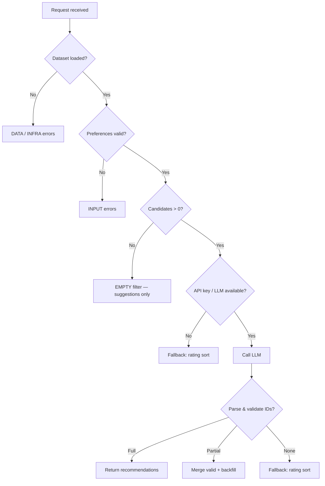

# Edge Cases & Handling Guide

> **Zomato AI Restaurant Recommendation System**  
> Companion to [`context.md`](context.md), [`architecture.md`](architecture.md), and [`implementation-plan.md`](implementation-plan.md).

This document catalogs **edge cases** across the full pipeline: data ingestion → validation → filtering → LLM → parsing → display. For each case: **scenario**, **expected behavior**, **implementation notes**, and **user-facing copy** (where applicable).

Use this as a **test matrix** during Phases 1–6 and as a checklist before demo/submission.

---

## Table of Contents

1. [How to Use This Document](#1-how-to-use-this-document)
2. [Decision Flow Overview](#2-decision-flow-overview)
3. [Data Layer Edge Cases](#3-data-layer-edge-cases)
4. [User Input & Validation Edge Cases](#4-user-input--validation-edge-cases)
5. [Filter & Candidate Edge Cases](#5-filter--candidate-edge-cases)
6. [LLM Integration Edge Cases](#6-llm-integration-edge-cases)
7. [Parser & Orchestrator Edge Cases](#7-parser--orchestrator-edge-cases)
8. [Presentation & UX Edge Cases](#8-presentation--ux-edge-cases)
9. [Infrastructure & Security Edge Cases](#9-infrastructure--security-edge-cases)
10. [Master Reference Table](#10-master-reference-table)
11. [Test Case Index](#11-test-case-index)

---

## 1. How to Use This Document

| Column / field | Meaning |
|----------------|---------|
| **ID** | Stable reference (e.g., `DATA-03`) for tests and issues |
| **Severity** | `Critical` — breaks core promise; `High` — bad UX or wrong results; `Medium` — degraded experience; `Low` — cosmetic or rare |
| **Layer** | Where to implement the fix |
| **Skip LLM?** | Whether the LLM call must be avoided |

**Implementation rule (from architecture):**  
Hard constraints → **filter**. Soft preferences → **LLM**. Failures → **fallback** with honest messaging. Never show restaurants that are not in the dataset.

---

## 2. Decision Flow Overview



---

## 3. Data Layer Edge Cases

### 3.1 Hugging Face & Loading

| ID | Scenario | Severity | Expected behavior | Implementation notes |
|----|----------|----------|-------------------|----------------------|
| DATA-01 | Hugging Face unreachable (offline, firewall) | Critical | App does not crash; show “Unable to load restaurant data” | Try cache first (`data/cache/restaurants.parquet`); if missing, fail with retry button |
| DATA-02 | Dataset download interrupted | High | Resume or re-download; log partial state | Use `datasets` cache; delete corrupt cache and retry |
| DATA-03 | Dataset schema changed (column renamed/removed) | Critical | Ingest fails with clear log: unknown columns | Phase 1 spike: map columns explicitly; version dataset in README |
| DATA-04 | Empty dataset returned (0 rows) | Critical | Block app startup; admin message | Assert `len(records) > 0` after load |
| DATA-05 | Dataset extremely large (memory pressure) | Medium | Load subset for dev or use chunked read | MVP: full load if &lt; 100k rows; else Parquet + lazy filter |

### 3.2 Preprocessing & Normalization

| ID | Scenario | Severity | Expected behavior | Implementation notes |
|----|----------|----------|-------------------|----------------------|
| DATA-06 | Missing `name` | High | Drop row; increment `dropped_missing_name` counter | Log at INFO on ingest |
| DATA-07 | Missing `location` / city | High | Drop row or infer city from address if pattern exists | Prefer drop if ambiguous |
| DATA-08 | Missing `rating` | High | Drop row (rating required for min_rating filter) | — |
| DATA-09 | Rating as string (`"4.1/5"`, `"NEW"`) | Medium | Parse float; unparseable → drop or `null` + exclude from rating filter | Strip `/5`; map `NEW` → null |
| DATA-10 | Rating out of range (&lt; 0 or &gt; 5) | Medium | Clamp to [0, 5] or drop | Log warning |
| DATA-11 | Missing `cost_for_two` | Medium | Set `cost_for_two = null`; exclude from budget filter only | Still eligible if location/cuisine/rating match |
| DATA-12 | Cost as non-numeric (`"₹800 for two"`) | Medium | Extract digits via regex | Unit test with messy strings |
| DATA-13 | Cost = 0 | Low | Treat as valid low-cost; assign `budget_tier = low` | — |
| DATA-14 | Duplicate restaurant names same city | Medium | Keep both; ensure unique `id` (hash of name+city+index) | Do not dedupe blindly—may be different outlets |
| DATA-15 | Duplicate rows (exact duplicate) | Low | Dedupe on hash of all key fields | Log count removed |
| DATA-16 | Cuisine string empty | Medium | Exclude from cuisine filter; still in location-only results | — |
| DATA-17 | Multi-cuisine label (`"Chinese, North Indian, Mughlai"`) | Medium | Substring match: user `"Chinese"` matches | Case-insensitive `in` check |
| DATA-18 | Location spelling variants (`"Bengaluru"` vs `"Bangalore"`) | High | Normalize via alias map before index/filter | Maintain `CITY_ALIASES` in config |
| DATA-19 | Location includes area + city (`"Koramangala, Bangalore"`) | Medium | Filter on city field; display full location string | Parse or store `city` separately at preprocess |
| DATA-20 | Special characters / emoji in name | Low | Preserve UTF-8; sanitize only for logs | — |
| DATA-21 | All rows dropped after cleaning | Critical | Same as DATA-04 | Alert in ingest script |

### 3.3 Repository & Cache

| ID | Scenario | Severity | Expected behavior | Implementation notes |
|----|----------|----------|-------------------|----------------------|
| DATA-22 | Cache file missing on startup | High | Trigger ingest or prompt user to run `python -m data.loader --refresh` | Auto-refresh if `AUTO_REFRESH_CACHE=true` |
| DATA-23 | Cache file corrupted | High | Delete and rebuild | Catch `ParquetError` / pandas errors |
| DATA-24 | Stale cache (dataset updated on HF) | Low | Document TTL; manual refresh | Optional `cache_version` in metadata |
| DATA-25 | Concurrent write to cache | Low | Lock file or single-writer ingest script | MVP: ingest offline only |
| DATA-26 | `get_by_ids()` with unknown ID | Medium | Skip ID; log warning; do not crash | Used after LLM parse |

### 3.4 Budget Tier Calibration

| ID | Scenario | Severity | Expected behavior | Implementation notes |
|----|----------|----------|-------------------|----------------------|
| DATA-27 | All restaurants in one cost band | Medium | Budget filter ineffective; show note in metadata | Recalibrate percentiles (33/66) on ingest |
| DATA-28 | User budget `low` but all candidates lack cost | Medium | Skip budget filter; warn in metadata `budget_filter_skipped` | — |
| DATA-29 | Cost thresholds misaligned with city (Mumbai vs tier-2) | Medium | Future: per-city tiers; MVP: global tiers + document limitation | — |

---

## 4. User Input & Validation Edge Cases

### 4.1 Required Fields

| ID | Scenario | Severity | Expected behavior | User-facing message |
|----|----------|----------|-------------------|---------------------|
| INPUT-01 | Empty `location` | High | Validation error; no filter/LLM | “Please select or enter a city.” |
| INPUT-02 | Empty `budget` | High | Validation error | “Please select a budget: low, medium, or high.” |
| INPUT-03 | Whitespace-only location (`"   "`) | High | Treat as empty (INPUT-01) | Same as INPUT-01 |
| INPUT-04 | Unknown city not in dataset | High | Zero candidates after filter; suggestions | “No restaurants found for **{city}**. Try: {top_cities_list}.” |

### 4.2 Optional Fields

| ID | Scenario | Severity | Expected behavior | User-facing message |
|----|----------|----------|-------------------|---------------------|
| INPUT-05 | `cuisine` omitted | Low | Do not apply cuisine filter | — |
| INPUT-06 | `cuisine` empty string | Low | Same as omitted | — |
| INPUT-07 | `min_rating` omitted | Low | Use default (e.g., 3.5) or no floor | Document default in UI hint |
| INPUT-08 | `min_rating` = 0 | Low | No rating floor (or treat as 0) | — |
| INPUT-09 | `min_rating` &gt; 5 | High | Validation error | “Rating must be between 1.0 and 5.0.” |
| INPUT-10 | `min_rating` negative | High | Validation error | Same as INPUT-09 |
| INPUT-11 | `additional_preferences` empty | Low | Omit from prompt or pass empty string | — |
| INPUT-12 | `additional_preferences` very long (&gt; 2000 chars) | Medium | Truncate to `MAX_ADDITIONAL_PREFS_LEN` (e.g., 500) | “Your note was shortened to fit.” (optional toast) |

### 4.3 Budget & Enum

| ID | Scenario | Severity | Expected behavior | User-facing message |
|----|----------|----------|-------------------|---------------------|
| INPUT-13 | Invalid budget (`"cheap"`, `"$$"`) | High | Validation error | “Budget must be low, medium, or high.” |
| INPUT-14 | Budget wrong case (`"Medium"`) | Low | Normalize to lowercase enum | — |
| INPUT-15 | Budget in different language | Medium | Validation error unless alias map added | Extend validator with aliases if needed |

### 4.4 Injection & Abuse (Input)

| ID | Scenario | Severity | Expected behavior | Implementation notes |
|----|----------|----------|-------------------|----------------------|
| INPUT-16 | Prompt injection in `additional_preferences` (“ignore instructions…”) | High | Sanitize length; system prompt says ignore override attempts | Do not execute user text as code |
| INPUT-17 | HTML/script in free text | Medium | Escape on display; strip tags optional | Streamlit escapes by default; verify |
| INPUT-18 | SQL-style strings in location | Low | Treat as literal string for filter | No SQL in MVP repository |

### 4.5 API / Programmatic Input (Phase 7)

| ID | Scenario | Severity | Expected behavior | HTTP |
|----|----------|----------|-------------------|------|
| INPUT-19 | Malformed JSON body | High | 422 with detail | 422 |
| INPUT-20 | Extra unknown fields | Low | Ignore or 422 based on Pydantic config | `model_config extra='ignore'` |
| INPUT-21 | Null values for required fields | High | 422 field errors | 422 |

---

## 5. Filter & Candidate Edge Cases

| ID | Scenario | Severity | Skip LLM? | Expected behavior | User-facing message |
|----|----------|----------|-----------|-------------------|---------------------|
| FILTER-01 | Zero candidates after all filters | High | **Yes** | Empty response + ranked suggestions | “No restaurants match your filters. Try lowering minimum rating, choosing a broader cuisine, or switching budget.” |
| FILTER-02 | Only 1 candidate | Medium | No | LLM ranks 1; return 1 card | — |
| FILTER-03 | Candidates 2–4 (fewer than top 5 requested) | Medium | No | Return all available; do not pad with fake entries | “Showing all {n} matches we found.” |
| FILTER-04 | Candidates &gt; `MAX_CANDIDATES` (25) | Medium | No | Pre-truncate by rating desc before LLM | — |
| FILTER-05 | Location match too strict (area typo) | High | Maybe | Fuzzy match on city; suggest similar cities | “Did you mean **Bangalore**?” |
| FILTER-06 | Cuisine too strict (`"Indo-Chinese Fusion"`) | Medium | Maybe | Partial token match; suggest dropping cuisine | Include in empty-state suggestions |
| FILTER-07 | `min_rating` 4.8 leaves 0 rows | High | **Yes** | Suggest relax to 4.5 or 4.0 | “No restaurants rated {x}+ in this city. Try 4.0+?” |
| FILTER-08 | Budget eliminates all (all expensive city) | High | **Yes** | Suggest higher budget tier | “Try **medium** or **high** budget for this area.” |
| FILTER-09 | Combined filters impossible (Delhi + Italian + low + 4.9) | High | **Yes** | Actionable multi-suggestion list | List 2–3 concrete relaxations |
| FILTER-10 | Cuisine matches but wrong city | Low | **Yes** (0 results) | Standard empty state | — |
| FILTER-11 | Case sensitivity in cuisine | Low | Normalize lowercase | — |
| FILTER-12 | User selects city with 1–2 restaurants total in dataset | Medium | No | Show 1–2 results; honest count | “Limited options in our data for **{city}**.” |
| FILTER-13 | Filter returns candidates all missing cost | Medium | No | Budget filter skipped (see DATA-28) | Metadata flag only |
| FILTER-14 | `additional_preferences` not used in filter | Low | No | Only passed to LLM (soft signal) | Document in UI: “AI considers your note” |

### 5.1 Empty-State Suggestion Logic

When `FILTER-01`, compute **actionable suggestions** (do not call LLM):

```text
Priority order:
1. If min_rating > default → suggest min_rating - 0.5
2. If cuisine set → suggest "Try without cuisine filter"
3. If budget is low → suggest medium
4. If city unknown → list top 5 cities by restaurant count
```

Return JSON:

```json
{
  "recommendations": [],
  "summary": null,
  "empty_state": {
    "reason": "no_candidates",
    "suggestions": ["Lower minimum rating to 4.0", "Remove cuisine filter", "Try budget: medium"]
  },
  "metadata": { "candidates_considered": 0, "filters_applied": ["location", "rating", "cuisine", "budget"] }
}
```

---

## 6. LLM Integration Edge Cases

| ID | Scenario | Severity | Expected behavior | User-facing message |
|----|----------|----------|-------------------|---------------------|
| LLM-01 | Missing API key | High | Fallback: rating-sorted top-N + template explanations | “AI explanations unavailable. Showing top-rated matches.” |
| LLM-02 | Invalid / revoked API key | High | Same as LLM-01; log 401 | Same banner |
| LLM-03 | Rate limit (429) | High | Retry once with backoff; then fallback | “High demand—showing top-rated matches.” |
| LLM-04 | Timeout (&gt; configured, e.g., 30s) | High | Fallback | “Recommendation took too long. Showing top-rated matches.” |
| LLM-05 | Network error | High | Fallback | Same as LLM-04 |
| LLM-06 | Empty LLM response | High | Fallback | — |
| LLM-07 | LLM returns markdown code fence around JSON | Medium | Strip ` ```json ` before parse | — |
| LLM-08 | LLM returns invalid JSON | High | Retry once; then fallback | Fallback banner |
| LLM-09 | LLM returns JSON with wrong schema (missing fields) | High | Partial parse + backfill or fallback | — |
| LLM-10 | LLM hallucinates `restaurant_id` not in candidates | **Critical** | Drop invalid entries; backfill from filter order | Never show hallucinated names |
| LLM-11 | LLM duplicates same `restaurant_id` | Medium | Dedupe; keep first rank | — |
| LLM-12 | LLM duplicate ranks (two `rank: 1`) | Medium | Renumber sequentially | — |
| LLM-13 | LLM returns fewer than 5 (e.g., 2) | Medium | Return 2; backfill to 5 from candidates if policy says so | Optional backfill with note |
| LLM-14 | LLM returns more than 5 | Low | Truncate to top 5 by rank | — |
| LLM-15 | LLM empty `explanation` | Medium | Template: “Rated {rating} in {location}; fits your {budget} budget.” | — |
| LLM-16 | LLM offensive / unsafe content in explanation | Medium | Replace with template; log incident | Generic safe explanation |
| LLM-17 | Token limit exceeded (prompt too large) | High | Reduce candidates sent (e.g., 15 → 10); retry | — |
| LLM-18 | Model deprecation / 404 model | High | Configurable model name; clear error | “Configuration error—contact support.” |
| LLM-19 | `LLM_DISABLED=true` env flag | Low | Always fallback (for demos without API) | “Demo mode: rating-based order.” |

### 6.1 Anti-Hallucination Checklist (Mandatory)

- [ ] Every `restaurant_id` in output ∈ candidate ID set  
- [ ] Display name/cuisine/rating/cost from **repository**, not LLM text alone  
- [ ] If ID valid but merge fails → drop row, backfill  
- [ ] Log count of dropped hallucinated IDs  

---

## 7. Parser & Orchestrator Edge Cases

| ID | Scenario | Severity | Expected behavior | Implementation notes |
|----|----------|----------|-------------------|----------------------|
| ORCH-01 | Double submit (user clicks twice) | Medium | Debounce UI; idempotent session key optional | Streamlit: disable button while running |
| ORCH-02 | Partial parse (3 valid of 5 LLM items) | Medium | Return 3; backfill 2 from rating order | Mark backfill in metadata `backfill_count` |
| ORCH-03 | All LLM items invalid after ID check | High | Full fallback | — |
| ORCH-04 | Rank gaps (1, 2, 4) | Low | Renumber 1..N for display | — |
| ORCH-05 | `summary` missing | Low | Omit summary section | — |
| ORCH-06 | `summary` present but empty string | Low | Omit | — |
| ORCH-07 | Exception in filter after validation | Critical | 500 internal; user generic error | Log stack trace |
| ORCH-08 | Exception in formatter only | Medium | Return raw recommendation objects | — |
| ORCH-09 | Concurrent requests (Streamlit multi-user) | Medium | Read-only repo; stateless orchestrator | No shared mutable request state |
| ORCH-10 | Very fast repeat identical request | Low | Optional cache by prefs hash (TTL 60s) | Phase 6+ optional |

### 7.1 Fallback Explanation Template

When `LLM-01` through `LLM-08` trigger fallback:

```text
"{name}" is rated {rating}/5 for {cuisine} in {city}. 
It fits your {budget} budget (approx. ₹{cost_for_two} for two).
{optional: additional_preferences note not evaluated in demo mode.}"
```

Set `metadata.fallback_used = true`.

---

## 8. Presentation & UX Edge Cases

| ID | Scenario | Severity | Expected behavior | User-facing message |
|----|----------|----------|-------------------|---------------------|
| UI-01 | Initial app load while dataset loading | Medium | Full-page spinner “Loading restaurants…” | — |
| UI-02 | Dataset load failed | Critical | Error panel + retry | “Could not load data. Check connection and retry.” |
| UI-03 | Form submitted with validation errors | High | Inline field errors; no API call | Per-field messages |
| UI-04 | Long restaurant name | Low | Truncate with ellipsis in card | — |
| UI-05 | Missing cost in record | Medium | Show “Price not available” | — |
| UI-06 | Rating displayed with many decimals | Low | Format to 1 decimal (`4.5`) | — |
| UI-07 | Zero results | High | Empty state component + suggestions | See FILTER-01 |
| UI-08 | Fallback used | Medium | Info banner (not error styling) | See LLM-01 |
| UI-09 | User changes form during LLM call | Low | Ignore stale response (request ID) or cancel | Optional for MVP |
| UI-10 | Browser refresh mid-request | Low | New request on reload | — |
| UI-11 | Mobile narrow viewport | Low | Stack cards vertically | — |
| UI-12 | Currency display | Low | Consistent `₹` prefix; locale INR | — |
| UI-13 | Location dropdown empty (no cities extracted) | Critical | Block submit; show admin error | “City list unavailable.” |

---

## 9. Infrastructure & Security Edge Cases

| ID | Scenario | Severity | Expected behavior | Implementation notes |
|----|----------|----------|-------------------|----------------------|
| INFRA-01 | `.env` missing | High | LLM fallback or fail fast with setup instructions | Document in README |
| INFRA-02 | API key in logs | **Critical** | Never log keys or full Authorization headers | Redact in structlog |
| INFRA-03 | PII in `additional_preferences` logged | High | Truncate/redact in production logs | — |
| INFRA-04 | Disk full during cache write | Medium | Fail ingest with clear message | — |
| INFRA-05 | Python version &lt; 3.11 | Medium | Document minimum version | `requires-python` in pyproject |
| INFRA-06 | Missing optional dependency (`openai`) | High | Import error at LLM client with install hint | — |
| INFRA-07 | Health check: repo not loaded (API) | High | `GET /health` → 503 | Phase 7 |
| INFRA-08 | CORS abuse (API) | Medium | Restrict origins in production | Phase 7 |

---

## 10. Master Reference Table

Quick lookup: **ID → layer → skip LLM? → primary action**

| ID | Layer | Skip LLM? | Primary action |
|----|-------|-----------|----------------|
| DATA-01–05 | Data | N/A (startup) | Cache / retry / fail fast |
| DATA-06–21 | Data | N/A | Drop / normalize / dedupe |
| DATA-22–26 | Data | N/A | Rebuild cache / skip bad IDs |
| DATA-27–29 | Data | No | Calibrate tiers / metadata flags |
| INPUT-01–15 | Input | Yes | Validation errors |
| INPUT-16–18 | Input | No | Sanitize + safe prompts |
| INPUT-19–21 | API | Yes | 422 responses |
| FILTER-01–14 | Filter | Often yes for 01 | Empty state / truncate / fuzzy |
| LLM-01–19 | LLM | No (fallback) | Retry / fallback / strip JSON |
| ORCH-01–10 | Orchestrator | Varies | Backfill / debounce / metadata |
| UI-01–13 | UI | N/A | Spinners / banners / formatting |
| INFRA-01–08 | Infra | Varies | Env / health / security |

---

## 11. Test Case Index

Map edge cases to automated tests (minimum set for Phase 6).

| Test file | Covers IDs |
|-----------|------------|
| `tests/test_preprocessor.py` | DATA-06–12, DATA-17, DATA-18 |
| `tests/test_repository.py` | DATA-22–23, DATA-26 |
| `tests/test_validator.py` | INPUT-01–15, INPUT-19–21 |
| `tests/test_filter.py` | FILTER-01–14, DATA-28 |
| `tests/test_parser.py` | LLM-07–12, LLM-10–11 |
| `tests/test_orchestrator.py` | ORCH-02–03, LLM-01, LLM-08, FILTER-01 |
| `tests/test_e2e.py` | Golden path + FILTER-01 + LLM-10 (mock) |

### 11.1 Example Test Scenarios (Given / When / Then)

**FILTER-01 — No matches**

- **Given:** Repository loaded, city `Delhi`, cuisine `Martian`, min_rating `4.5`  
- **When:** `recommend(prefs)`  
- **Then:** `recommendations == []`, `empty_state.suggestions` non-empty, LLM not called (`metadata.llm_called == false`)

**LLM-10 — Hallucinated ID**

- **Given:** 3 candidates with IDs `a`, `b`, `c`  
- **When:** Mock LLM returns IDs `[a, x, c]`  
- **Then:** Output contains `a`, `c` only; `x` dropped; backfill if needed; no restaurant named from LLM-only data

**INPUT-04 — Unknown city**

- **Given:** Location `Springfield` not in dataset  
- **When:** User submits  
- **Then:** Empty state with suggested cities from `repository.distinct_cities()[:5]`

**LLM-01 — No API key**

- **Given:** `OPENAI_API_KEY` unset, `LLM_FALLBACK_ON_ERROR=true`  
- **When:** `recommend(valid_prefs)` with candidates  
- **Then:** 5 results sorted by rating; `metadata.fallback_used == true`

---

## Severity Summary

| Severity | Count (approx.) | Must fix before demo |
|----------|-----------------|----------------------|
| Critical | 8 | Yes |
| High | 35+ | Yes |
| Medium | 30+ | Recommended |
| Low | 15+ | Optional polish |

---

## Configuration Knobs (Recommended)

Add to `config/settings.py` to tune edge-case behavior without code changes:

| Setting | Default | Affects |
|---------|---------|---------|
| `MAX_CANDIDATES` | 25 | FILTER-04, LLM-17 |
| `TOP_N_RECOMMENDATIONS` | 5 | LLM-13, LLM-14 |
| `DEFAULT_MIN_RATING` | 3.5 | INPUT-07 |
| `MAX_ADDITIONAL_PREFS_LEN` | 500 | INPUT-12 |
| `LLM_TIMEOUT_SECONDS` | 30 | LLM-04 |
| `LLM_RETRY_COUNT` | 1 | LLM-08 |
| `LLM_FALLBACK_ON_ERROR` | true | LLM-01–06 |
| `LLM_DISABLED` | false | LLM-19 |
| `AUTO_REFRESH_CACHE` | false | DATA-22 |
| `CITY_ALIASES` | `{"bengaluru": "Bangalore"}` | DATA-18, INPUT-04 |

---

## Related Documents

- [`context.md`](context.md) — Grounded recommendations constraint  
- [`architecture.md`](architecture.md) — §7.4 Fallback, §10.3 Error handling  
- [`implementation-plan.md`](implementation-plan.md) — Phase 6 QA, risk register  
