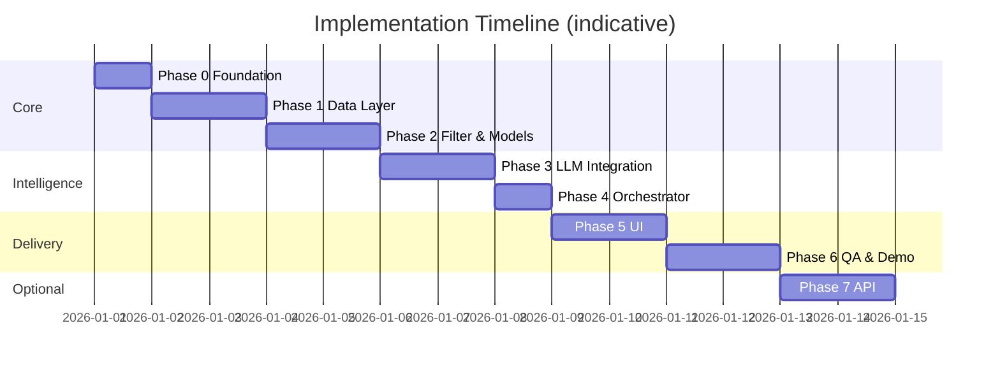
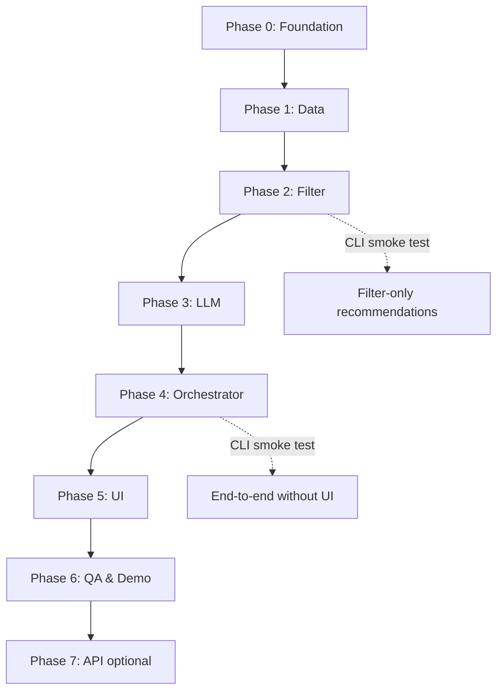

# Phase-Wise Implementation Plan

> **Zomato AI Restaurant Recommendation System**  
> Based on [`context.md`](context.md) and [`architecture.md`](architecture.md).

This plan breaks delivery into **seven phases**. Each phase has a clear goal, tasks, deliverables, acceptance criteria, and dependencies. Phases are ordered so you always have a runnable increment before adding LLM or UI complexity.

---

## Plan at a Glance

| Phase | Name | Maps to (context) | Primary architecture components | Est. effort |
|-------|------|-------------------|----------------------------------|-------------|
| **0** | Foundation & setup | — | Repo structure, config, env | 0.5–1 day |
| **1** | Data ingestion & storage | Workflow §1 | Loader, Preprocessor, Repository | 1–2 days |
| **2** | Preferences & filtering | Workflow §2–3 (partial) | Models, Validator, Filter Service | 1–2 days |
| **3** | LLM integration layer | Workflow §3–4 (partial) | Prompt Builder, Client, Parser | 1–2 days |
| **4** | Recommendation orchestration | Workflow §4 | Orchestrator, Formatter, fallbacks | 1 day |
| **5** | User interface | Workflow §2, §5 | Streamlit form, cards, empty states | 1–2 days |
| **6** | Quality, docs & demo | All objectives | Tests, logging, README, demo script | 1–2 days |
| **7** | *(Optional)* API & deploy | Future extension | FastAPI, health checks | 1–2 days |

**MVP (Phases 0–6):** ~6–10 days for a solo developer, depending on LLM familiarity and dataset quirks.



---

## Dependency Graph



**Parallelization tip:** After Phase 2, one person can build Phase 3 (LLM) while another sketches Phase 5 UI mockups—but **do not wire UI to LLM** until Phase 4 orchestrator is stable.

---

## Phase 0: Foundation & Project Setup

### Goal

Establish repository layout, dependencies, configuration, and conventions so later phases plug in without rework.

### Tasks

| # | Task | Details |
|---|------|---------|
| 0.1 | Initialize Python project | `pyproject.toml` or `requirements.txt`; Python 3.11+ |
| 0.2 | Create folder structure | Match [`architecture.md` §8.1](architecture.md#81-suggested-module-structure): `app/`, `core/`, `data/`, `llm/`, `config/`, `tests/` |
| 0.3 | Add `.gitignore` | Exclude `.env`, `__pycache__/`, `data/cache/`, `.venv/` |
| 0.4 | Environment template | `.env.example` with `GROQ_API_KEY` (or chosen provider), `MAX_CANDIDATES`, model name |
| 0.5 | Config module | `config/settings.py` using `pydantic-settings`: budget bands, paths, LLM params |
| 0.6 | Placeholder entry point | `app/main.py` prints version / loads config (proves imports work) |

### Deliverables

- Runnable virtual environment
- Documented module layout
- `.env.example` (no secrets committed)

### Acceptance criteria

- [ ] `pip install -r requirements.txt` succeeds
- [ ] `python -m app.main` runs without errors
- [ ] Config reads from environment with sensible defaults

### Dependencies

- None

---

## Phase 1: Data Ingestion & Storage

### Goal

Implement **Workflow §1 (Data Ingestion)** from `context.md`: load Hugging Face dataset, normalize fields, persist for fast reload, expose via repository.

### Tasks

| # | Task | Details |
|---|------|---------|
| 1.1 | Explore raw dataset | Load `ManikaSaini/zomato-restaurant-recommendation`; document column names and sample rows |
| 1.2 | Define canonical models | `core/models.py`: `Restaurant` dataclass/Pydantic model per architecture §5.1 |
| 1.3 | Implement loader | `data/loader.py`: download via `datasets`, return raw records |
| 1.4 | Implement preprocessor | `data/preprocessor.py`: trim strings, parse rating float, map cost, assign `budget_tier`, generate stable `id` |
| 1.5 | Calibrate budget tiers | Histogram `cost_for_two`; set low/medium/high thresholds in config |
| 1.6 | Data quality rules | Drop rows missing name, location, or rating; log dropped count |
| 1.7 | Persist cache | Save normalized data to `data/cache/restaurants.parquet` (or CSV) |
| 1.8 | Restaurant repository | `data/repository.py`: `load()`, `get_all()`, `get_by_ids()` |
| 1.9 | Ingest CLI/script | `python -m data.loader --refresh` to rebuild cache |

### Deliverables

- Normalized restaurant dataset on disk
- `Restaurant` model and populated repository
- Short note in code or README: raw → canonical field mapping

### Acceptance criteria

- [ ] Dataset downloads and caches successfully
- [ ] ≥ 90% of rows have valid name, location, rating (adjust after exploration)
- [ ] Repository loads in &lt; 5 s on laptop for MVP dataset size
- [ ] Spot-check: known Delhi restaurant retrievable by `get_all()`

### Dependencies

- Phase 0

### Architecture reference

- §4.2.1 Data Loader & Preprocessor  
- §4.2.2 Restaurant Repository  
- §5.1 Restaurant model  
- §5.2 Budget tier mapping  

---

## Phase 2: User Preferences & Candidate Filtering

### Goal

Implement **Workflow §2 (User Input)** validation and **Workflow §3 (Integration Layer)** deterministic filtering—**without LLM yet**. Prove the pipeline returns grounded candidates from real data.

### Tasks

| # | Task | Details |
|---|------|---------|
| 2.1 | `UserPreferences` model | Fields: location, budget, cuisine, min_rating, additional_preferences |
| 2.2 | Preference validator | `core/validator.py`: required location/budget; enum budget; rating range; city alias map |
| 2.3 | Filter service | `core/filter.py`: pipeline order—location → min_rating → cuisine → budget → cap at `MAX_CANDIDATES` |
| 2.4 | Empty-result handler | Structured response with suggestions (relax rating, change budget, etc.) |
| 2.5 | Metadata for filters | Return `filters_applied`, `candidates_considered` in response stub |
| 2.6 | CLI smoke test | Accept JSON prefs via stdin/file; print top 10 by rating (no LLM) |

### Deliverables

- `UserPreferences` + validation errors
- Working `CandidateFilterService`
- CLI: prefs in → filtered restaurant list out

### Acceptance criteria

- [ ] Invalid budget/location returns clear validation errors
- [ ] Filter: `Bangalore` + `medium` + `Italian` + `min_rating 4.0` returns only matching rows
- [ ] Result set capped at `MAX_CANDIDATES` (default 25)
- [ ] Zero results returns helpful empty state (no crash)
- [ ] All returned restaurants exist in repository (grounded)

### Dependencies

- Phase 1

### Architecture reference

- §4.2.3 Preference Validator  
- §4.2.4 Candidate Filter Service  
- §6 Request lifecycle (filter branches only)  

### Milestone

**Filter-only MVP:** User can get deterministic shortlists—useful for debugging data before spending on LLM tokens.

---

## Phase 3: LLM Integration Layer

### Goal

Implement **Workflow §3 (prompt design)** and **Workflow §4 (Recommendation Engine)** LLM pieces: prompt builder, API client, response parser—with anti-hallucination validation.

### Tasks

| # | Task | Details |
|---|------|---------|
| 3.1 | Prompt templates | `llm/prompts.py`: system + user template; version constant `PROMPT_VERSION` |
| 3.2 | Prompt builder | Serialize `UserPreferences` + slim candidate JSON (id, name, cuisine, rating, cost, location) |
| 3.3 | LLM client | `llm/client.py`: provider adapter for Groq only; timeout, retry once, low temperature |
| 3.4 | Output schema | Document expected JSON: `recommendations[]` with `restaurant_id`, `rank`, `explanation`; optional `summary` |
| 3.5 | Response parser | `llm/parser.py`: parse JSON; validate IDs ⊆ candidates; dedupe ranks |
| 3.6 | Merger | Hydrate full `Restaurant` fields from repository by ID |
| 3.7 | Fallback path | On timeout/invalid JSON: top-N by rating + template explanation string |
| 3.8 | Unit tests with fixtures | Mock LLM responses: valid, invalid ID, malformed JSON |

### Deliverables

- Versioned prompts
- `llm_client.complete(prompt) → str`
- `parser.parse_and_validate(raw, candidates) → List[Recommendation]`

### Acceptance criteria

- [ ] Prompt explicitly forbids restaurants outside candidate list
- [ ] Parser rejects unknown `restaurant_id` values
- [ ] Successful call returns top 5 with non-empty explanations
- [ ] Fallback triggers when mock client returns garbage (tested)
- [ ] Single recommendation request uses only provided candidate IDs

### Dependencies

- Phase 2 (need real candidate lists for integration tests)

### Architecture reference

- §4.2.5 Prompt Builder  
- §4.2.6 LLM Integration Client  
- §4.2.7 LLM Response Parser & Merger  
- §7 Integration Layer & LLM Design  
- §7.4 Fallback Strategy  

---

## Phase 4: Recommendation Orchestration & Formatting

### Goal

Wire the full **recommend** use case: validate → filter → prompt → LLM → parse → format. Satisfy **Workflow §4** end-to-end in code (still CLI-acceptable).

### Tasks

| # | Task | Details |
|---|------|---------|
| 4.1 | `Recommendation` + `RecommendationResponse` models | Per architecture §5.1 |
| 4.2 | Results formatter | `core/formatter.py`: map to display dict / card structure |
| 4.3 | Orchestrator | `core/orchestrator.py`: `recommend(UserPreferences) -> RecommendationResponse` |
| 4.4 | Logging | Log candidate count, filter ms, LLM latency, fallback used (no API keys in logs) |
| 4.5 | CLI end-to-end | `python -m app.main recommend --location Delhi --budget low --cuisine Chinese` |
| 4.6 | Integration test | Mock LLM; assert orchestrator returns 5 grounded items |

### Deliverables

- Single public API: `recommend(preferences)`
- CLI demonstrating full pipeline
- Formatter output matching required fields: name, cuisine, rating, cost, explanation

### Acceptance criteria

- [ ] Happy path: prefs → 5 recommendations with explanations + optional summary
- [ ] Empty filter: no LLM call; user sees suggestions
- [ ] LLM failure: fallback rankings with clear message
- [ ] Every output row maps to a real dataset record
- [ ] Total flow demonstrable in &lt; 15 s (with loading message in UI later)

### Dependencies

- Phases 2 and 3

### Architecture reference

- §4.2.8 Recommendation Orchestrator  
- §4.2.9 Results Formatter  
- §6 Request lifecycle (full)  
- Appendix A: steps 3–4  

---

## Phase 5: User Interface (Presentation Layer)

### Goal

Implement **Workflow §2 (User Input)** collection and **Workflow §5 (Output Display)** in a user-friendly app—Streamlit recommended for MVP per architecture §11.

### Tasks

| # | Task | Details |
|---|------|---------|
| 5.1 | Streamlit app shell | `app/main.py` or `app/streamlit_app.py` |
| 5.2 | Preference form | Location dropdown (from repo distinct cities), budget radio, cuisine text, rating slider, additional prefs textarea |
| 5.3 | Submit + loading state | Spinner during LLM call; disable double-submit |
| 5.4 | Results cards | Rank, name, cuisine, rating, ₹ cost, explanation per §9.2 |
| 5.5 | Summary section | Show LLM `summary` when present |
| 5.6 | Empty & error states | No matches; validation errors; LLM fallback banner |
| 5.7 | Session caching | `@st.cache_resource` for repository load |
| 5.8 | README run instructions | `streamlit run app/main.py` |

### Deliverables

- Runnable Streamlit demo
- UI aligned with input/output contract (architecture §9)

### Acceptance criteria

- [ ] Non-technical user can submit preferences without editing code
- [ ] Results show all five required fields from `context.md`
- [ ] Empty state guides user to broaden filters
- [ ] App survives refresh after initial data load
- [ ] Matches Zomato-style “preference in → explained picks out” experience

### Dependencies

- Phase 4

### Architecture reference

- §3.1 Presentation layer  
- §9 Interface & Output Contract  
- §12.1 Local / Demo deployment  

---

## Phase 6: Quality Assurance, Documentation & Demo Readiness

### Goal

Harden the MVP for submission, interview demo, or portfolio: tests, docs, sample scenarios, and constraint verification from `context.md`.

### Tasks

| # | Task | Details |
|---|------|---------|
| 6.1 | Unit tests | `tests/test_preprocessor.py`, `test_filter.py`, `test_parser.py` |
| 6.2 | Integration test | Orchestrator with mocked LLM (golden path Delhi + medium + Chinese) |
| 6.3 | Constraint checklist | Verify grounded data, LLM-only-on-candidates, readable output |
| 6.4 | README | Problem summary, setup, env vars, run commands, architecture link |
| 6.5 | Demo script | 3 preset scenarios (e.g., Bangalore Italian family-friendly; Delhi low-budget Chinese; Mumbai high-rated) |
| 6.6 | Error handling pass | Dataset missing, bad API key, network timeout |
| 6.7 | Optional: `requirements.txt` pin | Reproducible installs |

### Deliverables

- Test suite (`pytest`)
- README with setup and demo steps
- Demo scenario document or section in README

### Acceptance criteria

- [ ] `pytest` passes locally
- [ ] README allows fresh clone → running app in &lt; 30 min (excluding HF download)
- [ ] All four objectives in `context.md` demonstrable in one demo recording or walkthrough
- [ ] No API keys in repository

### Dependencies

- Phase 5

### Architecture reference

- §10.3 Error Handling  
- §10.4 Testing Strategy  
- §10.1 Security  

---

## Phase 7 (Optional): REST API & Deployment

### Goal

Expose the orchestrator via HTTP for integration or portfolio extension—not required for core assignment.

### Tasks

| # | Task | Details |
|---|------|---------|
| 7.1 | FastAPI app | `POST /api/v1/recommendations`, `GET /health` |
| 7.2 | Request/response models | Reuse Pydantic models from `core/models.py` |
| 7.3 | Startup lifecycle | Load repository on app startup |
| 7.4 | CORS (if needed) | For separate frontend later |
| 7.5 | Deploy notes | Local uvicorn; optional Streamlit Cloud / Render / Railway |
| 7.6 | Metadata endpoint | `GET /api/v1/metadata/locations` for autocomplete |

### Deliverables

- Documented API
- Optional hosted demo URL

### Acceptance criteria

- [ ] Postman/curl can get recommendations JSON
- [ ] Same grounding rules as Streamlit path
- [ ] Health check returns 200 when data loaded

### Dependencies

- Phase 6 (stable core)

### Architecture reference

- §8.2 API Surface  
- §12.2 Hosted topology  

---

## Traceability Matrix

Maps each `context.md` requirement to implementation phases.

| Context requirement | Phase(s) |
|---------------------|----------|
| Load HF Zomato dataset | 1 |
| Extract name, location, cuisine, cost, rating | 1 |
| Collect location, budget, cuisine, min rating, extras | 2, 5 |
| Filter data from user input | 2 |
| Pass structured results to LLM prompt | 3, 4 |
| LLM ranks and explains | 3, 4 |
| Optional summarize choices | 3, 4, 5 |
| Display name, cuisine, rating, cost, explanation | 4, 5 |
| Grounded in real data (no hallucinated restaurants) | 2, 3, 4 |
| Human-like, personalized recommendations | 3, 4, 5 |

---

## Per-Phase Definition of Done

Use this checklist before moving to the next phase.

| Phase | Definition of Done |
|-------|-------------------|
| **0** | Project installs, config loads, structure matches architecture |
| **1** | Repository serves normalized restaurants from cache |
| **2** | Filters return correct grounded subsets; CLI works |
| **3** | LLM returns valid JSON; parser enforces ID whitelist |
| **4** | `recommend()` works CLI-only with fallbacks |
| **5** | Streamlit demo runnable by evaluator without code changes |
| **6** | Tests pass; README + demo scenarios complete |
| **7** | API returns same results as UI for identical prefs |

---

## Risk Register & Mitigations

| Risk | Impact | Mitigation | Phase |
|------|--------|------------|-------|
| Dataset columns differ from assumptions | Blocked ingestion | Phase 1.1 exploration spike first | 1 |
| Sparse data for some cities | Empty filters | City list in UI; suggest nearby cities | 2, 5 |
| LLM hallucinates extra restaurants | Wrong recommendations | ID validation + strict prompt | 3 |
| High API cost/latency | Poor UX | Cap candidates; use mini model; cache nothing sensitive | 3, 5 |
| Budget tiers misaligned with data | Bad budget filter | Calibrate from histogram in Phase 1 | 1 |
| API key missing in demo | Demo failure | Document `.env`; fallback-only mode flag | 0, 3, 6 |

---

## Suggested Weekly Schedule (Solo)

| Week | Phases | Outcome |
|------|--------|---------|
| **Week 1** | 0 → 1 → 2 | Data loaded; filter CLI works |
| **Week 2** | 3 → 4 → 5 | End-to-end Streamlit demo |
| **Week 3** | 6 (+ 7 if time) | Polished submission / portfolio piece |

---

## File Checklist (End of Phase 6)

```
zomato-recommender/
├── app/
│   ├── main.py
│   └── ui/                    # optional Streamlit components
├── core/
│   ├── models.py
│   ├── validator.py
│   ├── filter.py
│   ├── formatter.py
│   └── orchestrator.py
├── data/
│   ├── loader.py
│   ├── preprocessor.py
│   ├── repository.py
│   └── cache/
│       └── restaurants.parquet
├── llm/
│   ├── client.py
│   ├── prompts.py
│   └── parser.py
├── config/
│   └── settings.py
├── tests/
│   ├── test_filter.py
│   ├── test_parser.py
│   └── test_orchestrator.py
├── .env.example
├── .gitignore
├── requirements.txt
├── README.md
├── context.md
├── architecture.md
└── implementation-plan.md   # this file
```

---

## Related Documents

- [`context.md`](context.md) — Scope, workflow, constraints  
- [`architecture.md`](architecture.md) — Components, data models, LLM design  
- [`docs/Problem statement.txt`](docs/Problem%20statement.txt) — Original brief  
